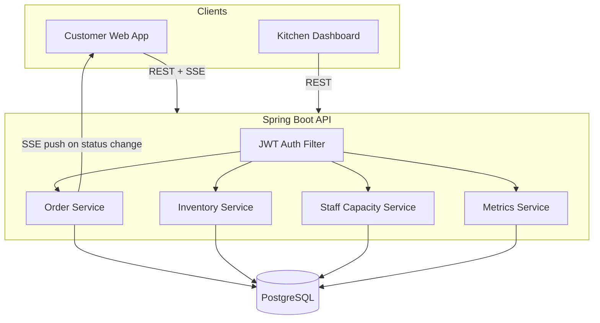

# QShift — Backend

> Spring Boot REST API + SSE backend for the QShift pre-ordering platform. Handles JWT authentication, order lifecycle management, real-time push events, inventory deduction, slot booking, staff capacity, and kitchen metrics for any food service venue operating at scale.

[](https://openjdk.org)
[](https://spring.io/projects/spring-boot)
[](https://www.postgresql.org)
[](https://jwt.io)

---

## Table of Contents

- [What Problem Does It Solve?](#what-problem-does-it-solve)
- [Key Engineering Highlights](#key-engineering-highlights)
- [Architecture](#architecture)
- [Features](#features)
- [Tech Stack](#tech-stack)
- [API Reference](#api-reference)
- [Database Schema](#database-schema)
- [Engineering Challenges & Solutions](#engineering-challenges--solutions)
- [Setup](#setup)
- [Detailed Documentation](#detailed-documentation)
- [Related Repositories](#related-repositories)

---

## What Problem Does It Solve?

Campus and office canteens lose time to physical queues, unpredictable wait times, and kitchens that can't see demand coming. QShift replaces that with **pre-ordering, pickup-slot scheduling, and live kitchen capacity balancing** — customers order ahead and get a real pickup time, while the kitchen sees a prioritized queue instead of a crowd.

It also cuts a cost most kitchens absorb quietly: food waste. When a kitchen has to guess at demand to stay ahead of a queue, it over-prepares, and unsold food gets thrown out. Because every order here is placed and confirmed before cooking starts, the kitchen prepares exactly what's been ordered — nothing more.

This repository is the backend: a single Spring Boot service exposing REST + SSE APIs consumed by two frontend roles — **Customer** and **Kitchen Staff**.

---

## Key Engineering Highlights

This isn't a CRUD-with-login project — the parts below are what separate it from a tutorial build:

| Highlight | Why it matters |
|---|---|
| 🔐 **JWT Auth + Role-Based Access** | Stateless sessions; `CUSTOMER` and `KITCHEN` roles enforced at the route level, with a separate OTP-based flow for admin login |
| ⚡ **Real-Time Order Updates (SSE)** | Customers see status changes the instant the kitchen updates them — no polling required, with a 15s-polling fallback if the stream drops |
| 🔄 **Order Lifecycle State Machine** | Strict `PENDING → COOKING → READY → COMPLETED` transitions with cancellation and rollback paths, all timestamped |
| 🔒 **Pessimistic Locking & Deadlock Resolution** | Found and fixed a real database deadlock caused by duplicate row-level locks under concurrent order promotion — see [Engineering Challenges](#engineering-challenges--solutions) |
| 📦 **Recipe-Linked Inventory Deduction** | Stock is deducted per dish based on an ingredient-mapping table the moment an order starts cooking, failing non-fatally so a stock hiccup never blocks the kitchen |
| 🧠 **Capacity-Based Auto-Assignment** | Orders are auto-routed to the least-loaded active chef; backup staff are auto-suggested once the queue crosses 80% of active capacity |
| 🕒 **Timezone-Correct Metrics** | All kitchen analytics compute against `Asia/Kolkata`, fixing a bug where metrics silently read zero for the first 5.5 hours of every day |

---

## Architecture



### Request Flow

```
HTTP Request
  └── CorsFilter
        └── JwtAuthFilter
              ├── Reads Authorization header (Bearer token)
              │   OR ?token= query param (for SSE)
              ├── Validates JWT via JwtUtil
              ├── Populates SecurityContextHolder
              └── Spring Security AuthorizationFilter
                    ├── /api/customer/sse/** → permitAll() (JwtAuthFilter already validated)
                    ├── /api/customer/**    → hasRole("CUSTOMER")
                    ├── /api/kitchen/**     → hasRole("KITCHEN")
                    └── Controller
```

### Order Creation Flow

```
POST /api/customer/orders
  └── OrderService.createOrder(orderRef, menuItemIds, email, pickupSlotId)
        ├── Validates pickupSlotId exists and has remaining capacity
        ├── Validates each menuItemId exists in MenuItem table
        ├── Builds Order + OrderItems, sets totalPrepTimeMinutes = max(item prep times)
        ├── Links and books the pickup slot (currentBookings + 1)
        ├── Checks kitchen capacity: (currentPending < maxQueueDepth OR currentCooking < capacity)
        │     └── If over capacity → rollback slot booking → throw SlotUnavailableException
        ├── Checks queue fill ratio > 80% → logs backup staff suggestion (or auto-activates in AUTO mode)
        └── Saves order → returns CustomerOrderDto
```

### Status Transition Flow

```
PATCH /api/kitchen/orders/:id/status  { targetStatus: "COOKING" }
  └── OrderService.transition(orderId, COOKING)
        ├── Validates PENDING → COOKING is a legal transition
        ├── Checks chef assignment
        │     └── If no chef → tries autoAssignChef (picks least-loaded ACTIVE chef)
        │           └── If still no chef → throws (manual assignment required)
        ├── deductInventoryForOrder(order) — non-fatal, logs warning on failure
        ├── Stamps cookingStartedAt = Instant.now()
        ├── Saves order with new status
        └── CustomerSseController.pushStatusUpdate(orderId, COOKING) → customer stream
```

### Deadlock Elimination in `promoteNextPendingOrder`

The simulation advance path previously had a deadlock: `promoteNextPendingOrder` ran in `REQUIRES_NEW`, acquired a `SELECT FOR UPDATE` on the candidate order, then called `autoAssignChef(orderId)` which tried to acquire a second `SELECT FOR UPDATE` on the same row. Two concurrent simulation ticks on the same candidate order caused a DB-level deadlock.

Fix: `promoteNextPendingOrder` now locks the order row once with `findByIdWithLock`, then calls `assignChefToOrder(order)` — passing the already-locked entity directly. `assignChefToOrder` only locks the chef row, never the order row again. Zero duplicate lock acquisitions.

---

## Features

### Authentication

- Customer registration (email + password + full name) with duplicate email guard
- Customer login returning a signed JWT (`CUSTOMER` role)
- Admin / kitchen staff login via OTP email flow (6-digit, 5-minute expiry, single use)
- JWT validated on every request by `JwtAuthFilter` before the Spring Security role check
- Stateless session — no HTTP sessions, no cookies required
- Role-based route protection: `CUSTOMER` role for `/api/customer/**`, `KITCHEN` role for `/api/kitchen/**`
- SSE endpoint (`/api/customer/sse/**`) exempt from role check at the security layer — JWT validated via `?token=` query param by `JwtAuthFilter`

### Order Lifecycle

Orders move through a strict state machine:

```
PENDING → COOKING → READY → COMPLETED
                  ↘
              CANCELLED (from any state)
```

- **Order creation**: validates menu item UUIDs, links a pickup slot (if provided), deducts slot capacity, assigns the order to the queue
- **PENDING → COOKING**: requires a chef assignment; auto-assigns least-loaded ACTIVE chef if none assigned; deducts ingredients from inventory via recipe table (non-fatal — never blocks cooking)
- **COOKING → READY**: stamps `readyAt` timestamp; triggers auto-promotion of the next PENDING order (simulation path only)
- **READY → COMPLETED**: stamps `completedAt`
- Status timestamps (`placedAt`, `cookingStartedAt`, `readyAt`, `completedAt`) recorded on every transition
- Every transition pushes a real-time SSE event to the customer's open stream

### Scheduled Orders (Pre-order for Tomorrow)

- Customers select a slot from tomorrow's available windows (Breakfast / Lunch / Afternoon / Dinner periods)
- `pickupSlotId` included in `CreateOrderRequest` and linked at order creation time
- Slot capacity decremented on booking; enforced server-side — full slots return a clear error
- `CustomerOrderDto.pickupSlotTime` returns the slot as ISO-8601 UTC — frontend displays it as the pickup time
- Order reference tagged with `-SCHEDULED` suffix for priority sorting

### Express Orders

- Order reference tagged with `-EXPRESS` suffix
- Express orders sorted to the front of the PENDING queue in `promoteNextPendingOrder()` — they start cooking before normal orders regardless of slot time
- Frontend filters arrival window options by `meal.prepTime` (only achievable arrival windows shown)

### Kitchen Capacity & Staff Management

- Each chef has a `maxConcurrentOrders` limit
- `getActiveCapacity()` — sum of all ACTIVE chefs' limits
- `getMaxQueueDepth()` — 2× active capacity
- Auto-assignment: picks the ACTIVE chef with the fewest current cooking orders
- Backup chef auto-activation when queue exceeds 80% of capacity (configurable: `SUGGEST` vs `AUTO` mode)
- Staff removal validation: blocks removal of the last active chef if cooking orders exist; estimates reassignment delay and queue throttle impact
- Workload snapshot per chef: cooking load %, total active orders, completed today

### Pickup Slot Management

- Slots seeded on every boot: 8 slots for today (every 30 min from next half-hour), 4 slots for tomorrow (11:00–14:00)
- `maxCapacity: 5` per slot
- `currentBookings` incremented on order creation, decremented on rollback
- `hasCapacity()` check enforced server-side before booking
- Only future slots returned by the API (`findBySlotTimeAfterOrderBySlotTimeAsc`)
- Slots grouped by period in `CustomerSlotDto`: Breakfast (<11:00) / Lunch (<15:00) / Afternoon (<18:00) / Dinner

### Inventory

- 27 ingredients seeded across 6 categories: Proteins, Vegetables, Grains, Sauces, Dairy, Spices, Beverages
- `MenuItemRecipe` table maps each menu item to its required ingredients with quantities
- Recipes for 6 dishes seeded: Butter Chicken, Dal Makhani, Palak Paneer, Kadai Paneer, Prawn Masala, Vada Pav
- Ingredients automatically deducted when an order transitions to COOKING (`consumeForMenuItem`)
- Deduction is non-fatal — inventory failure logs a warning but never blocks an order from cooking
- Manual restock and stock-set endpoints available from kitchen dashboard

### Metrics

- Computed per date (defaults to today in IST timezone)
- Average cook time: `cookingStartedAt` → `readyAt` with stale-reading guard (>3× prep time ignored)
- Efficiency (on-time rate): percentage of completed orders ready before their pickup slot deadline; orders without a slot checked against their `prepTimeMinutes` budget
- Capacity utilisation: `(cooking + pending) / total chef capacity × 100`
- Late orders: orders in COOKING status that have exceeded 1.5× their prep time budget
- `KitchenMetricsDto` fields: `avgCookTimeMinutes`, `efficiencyPercent`, `capacityUtilizationPercent`, `completedOrdersToday`, `lateOrdersCount`, `activeChefCount`, `totalOrdersToday`

### Kitchen Summary (Customer-facing)

`GET /api/customer/kitchen-summary` returns a purpose-built DTO for the customer dashboard:

- Top dish ordered today (by item quantity across all orders)
- Busiest hour today (by order count)
- Average prep time today
- Bottleneck detection: flags when 3+ orders are cooking and any has exceeded 1.5× its prep budget

### Customer Metrics

`GET /api/customer/metrics` computes per-customer:

- Orders this month (calendar month in IST)
- Time saved: sum of `floor(prepTime × 0.8)` per order
- Loyalty points: `floor(totalPrice / 10)` per order
- Food waste reduced: `orders.size() × 0.15 kg`

`GET /api/customer/streak` computes consecutive days with at least one order, counting backwards from today. Returns 0 if no order yesterday or today.

### Real-time SSE

- Each authenticated customer can open a persistent SSE stream per order
- Every status transition pushes an event immediately
- `CustomerSseController` manages a registry of `SseEmitter` instances keyed by order ID
- SSE path exempt from Spring Security role check at the matcher level (JWT still validated via `?token=` param)
- Emitter cleaned up on timeout or client disconnect
- Frontend falls back to 15-second polling if SSE connection fails

### Kitchen Simulation

- `POST /api/kitchen/simulate-advance` promotes pending orders to COOKING in priority order
- Priority sort: Express first → earliest slot time → oldest `placedAt` (FIFO)
- Runs up to `activeCapacity` promotions per call, stopping when kitchen is full
- Each promotion auto-assigns a chef and sets `cookingStartedAt`
- Simulation orders generated via `triggerSimulation()` in frontend with random customer names, random order types (express 25%, normal 50%, scheduled 25%), and random item sets

---

## Tech Stack

| Layer | Technology |
|---|---|
| Framework | Spring Boot 3 |
| Language | Java 17 |
| Security | Spring Security + JWT (JJWT) |
| ORM | Spring Data JPA / Hibernate |
| Database | PostgreSQL 15 |
| Real-time | SSE via `SseEmitter` |
| Email | Spring Mail (Gmail SMTP, for Admin OTP) |
| Build | Maven |
| Connection Pool | HikariCP (pool size 20, leak detection 15s) |

---

## API Reference

### Auth

| Method | Endpoint | Auth | Description |
|---|---|---|---|
| `POST` | `/api/auth/register` | Public | Register customer — `{ fullName, email, password }` |
| `POST` | `/api/auth/login` | Public | Login — returns `{ token, role, email, fullName }` |
| `POST` | `/api/auth/logout` | Bearer | Invalidate session (client clears token) |
| `POST` | `/api/admin/auth/send-otp` | Public | Send OTP to admin email |
| `POST` | `/api/admin/auth/verify-otp` | Public | Verify OTP — returns admin JWT |

### Customer

| Method | Endpoint | Auth | Description |
|---|---|---|---|
| `GET` | `/api/customer/menu-items` | Public | All available menu items |
| `POST` | `/api/customer/orders` | Customer | Place order (Normal / Express / Scheduled) |
| `GET` | `/api/customer/orders` | Customer | All orders for the authenticated customer |
| `GET` | `/api/customer/orders/:id` | Customer | Single order (ownership verified) |
| `GET` | `/api/customer/metrics` | Customer | `ordersThisMonth`, `timeSaved`, `loyaltyPoints`, `foodWasteReduced` |
| `GET` | `/api/customer/streak` | Customer | `{ streak: N }` — consecutive daily order count |
| `GET` | `/api/customer/kitchen-summary` | Customer | Top dish, busiest hour, avg prep, bottleneck flag |
| `GET` | `/api/customer/slots` | Customer | Today's available pickup slots (future only) |
| `GET` | `/api/customer/slots/tomorrow` | Customer | Tomorrow's pickup slots grouped by period |
| `GET` | `/api/customer/addons` | Customer | Available add-ons for order customisation |
| `GET` | `/api/customer/stats` | Public | `totalOrdersDelivered`, `totalCustomers`, `totalMenuItems`, `avgRating` |
| `GET` | `/api/customer/sse/orders/:id/stream` | JWT via `?token=` | SSE stream for order status updates |

### Kitchen

| Method | Endpoint | Auth | Description |
|---|---|---|---|
| `GET` | `/api/kitchen/board` | Kitchen | Full kanban board: orders + metrics + staff + slots |
| `GET` | `/api/kitchen/menu-items` | Kitchen | All available menu items |
| `POST` | `/api/kitchen/orders` | Kitchen | Create order (simulation) |
| `PATCH` | `/api/kitchen/orders/:id/status` | Kitchen | Transition to `COOKING`, `READY`, `COMPLETED`, or `CANCELLED` |
| `PATCH` | `/api/kitchen/orders/:id/assign-chef` | Kitchen | Assign chef to order |
| `PATCH` | `/api/kitchen/orders/:id/reserve-slot` | Kitchen | Book a pickup slot for an existing order |
| `POST` | `/api/kitchen/simulate-advance` | Kitchen | Promote PENDING → COOKING (express-first priority) |
| `GET` | `/api/kitchen/metrics` | Kitchen | Analytics for `?date=YYYY-MM-DD` (defaults to today) |
| `GET` | `/api/kitchen/server-time` | Kitchen | `{ serverTimeMs }` for frontend clock sync |
| `GET` | `/api/kitchen/staff` | Kitchen | All ACTIVE and BACKUP staff with workload |
| `POST` | `/api/kitchen/staff` | Kitchen | Add new staff member |
| `PATCH` | `/api/kitchen/staff/:id/activate` | Kitchen | Set status to ACTIVE |
| `PATCH` | `/api/kitchen/staff/:id/remove-from-shift` | Kitchen | Set status to BACKUP |
| `GET` | `/api/kitchen/staff/:id/validate-removal` | Kitchen | Safety check before removing chef |
| `GET` | `/api/kitchen/inventory` | Kitchen | All inventory items with stock status |
| `PATCH` | `/api/kitchen/inventory/:id/stock` | Kitchen | Set absolute stock level |
| `PATCH` | `/api/kitchen/inventory/:id/restock` | Kitchen | Add quantity to current stock |
| `DELETE` | `/api/kitchen/inventory/:id` | Kitchen | Remove inventory item |

---

## Database Schema

### Core Tables

| Table | Key Columns |
|---|---|
| `customers` | `id`, `email` (unique), `password` (BCrypt), `full_name`, `active` |
| `admins` | `id`, `email` (unique), `organisation`, `kitchen_name`, `active` |
| `admin_otps` | `id`, `email`, `otp`, `expiry_time`, `used` |
| `menu_items` | `id` (UUID), `name`, `prep_time_minutes`, `price`, `category`, `is_express`, `available` |
| `menu_item_recipes` | `id`, `menu_item_id` (FK), `inventory_item_id`, `inventory_item_name`, `quantity` |
| `orders` | `id` (UUID), `order_ref`, `customer_name`, `status`, `assigned_chef_id` (FK), `pickup_slot_id` (FK), `total_prep_time_minutes`, `placed_at`, `cooking_started_at`, `ready_at`, `completed_at`, `version` |
| `order_items` | `id`, `order_id` (FK), `menu_item_id` (FK), `quantity`, `prep_time_minutes` |
| `pickup_slots` | `id` (UUID), `slot_time` (LocalDateTime IST), `max_capacity`, `current_bookings` |
| `inventory_items` | `id`, `name`, `category`, `current_stock`, `max_capacity`, `unit`, `min_threshold`, `critical_threshold`, `cost_per_unit`, `supplier`, `last_restocked` |
| `kitchen_staff` | `id` (UUID), `name`, `max_concurrent_orders`, `status` (ACTIVE/BACKUP) |

### Indexes

`orders` has explicit indexes on `status` and `placed_at`:
- `idx_orders_status` — `findByStatus()` is called on every board poll (every 10s) and on every transition
- `idx_orders_placed_at` — used for `simulate-advance` sort and `completed-today` queries

---

## Engineering Challenges & Solutions

| Area | Problem | Fix |
|---|---|---|
| SSE always returned 401 | Spring Security evaluated `/api/customer/sse/**` against `hasRole("CUSTOMER")` before `JwtAuthFilter` ran. SecurityContext was empty at match time → 401 before `?token=` could be read | Added `requestMatchers("/api/customer/sse/**").permitAll()` **before** the `/api/customer/**` wildcard in `SecurityConfig`. Spring Security stops at first match — SSE path bypasses role check, `JwtAuthFilter` still validates the token |
| Customer orders not found | `JwtAuthFilter` stores email as the JWT subject/principal. Orders were looked up by `customerName` which sometimes stored the display name instead of email → no orders found | `getOrdersForCustomer(email)` now does a primary lookup by email + a fallback search by email local-part to catch legacy orders stored before the fix |
| Order ownership bypass | `getOrderForCustomer` had no ownership check — any authenticated customer could fetch any order by UUID | Added ownership check: stored `customerName` must match the requesting email or its local-part |
| Slot booking not dropped on full-capacity rejection | When the kitchen was full, `createOrder` threw but the slot `currentBookings` had already been incremented → slot capacity permanently leaked | Added rollback: decrement `currentBookings` on the slot before throwing `SlotUnavailableException` |
| `pickupSlotId` dropped on kitchen-side order creation | `OrderController.createOrder()` called the 3-arg `createOrder` overload — `pickupSlotId` from `CreateOrderRequest` was silently ignored for all simulation orders | Changed to call the 4-arg overload, passing `request.pickupSlotId()` |
| Metrics always showed 0 all day | `MetricsService` used `Instant.now().atZone(ZoneId.systemDefault())` which was UTC midnight (05:30 IST) — no orders were "today" until 05:30 | Changed to `ZoneId.of("Asia/Kolkata")` — `startOfDay` is now midnight IST |
| Board payload included all historical slots | `getBoardSnapshot()` called `findAll()` on slots — returned every slot ever seeded, including past ones. Frontend had to filter client-side; stale data inflated the payload on every 10s poll | Changed to `findBySlotTimeAfterOrderBySlotTimeAsc(now)` — only future slots returned |
| Deadlock in simulation | `promoteNextPendingOrder` (REQUIRES_NEW) locked an order row, then called `autoAssignChef(orderId)` which called `findByIdWithLock` on the same row. Two concurrent ticks → DB deadlock | `promoteNextPendingOrder` now passes the already-locked `Order` entity directly to `assignChefToOrder()`. `assignChefToOrder` only locks the chef row — zero duplicate order row locks |
| `OrderStatus.java` not serialised as lowercase | `CustomerOrderDto` used `order.getStatus()` directly → serialised as uppercase `"PENDING"`. Frontend `statusMap` looked up lowercase keys → always fell through to default | `CustomerOrderDto.from()` calls `order.getStatus().name().toLowerCase()` |
| `totalPrice` missing from customer response | `CustomerOrderDto` had no `totalPrice` field → `OrderHistory` always showed "—" | Added `totalPrice` computed as `sum(menuItem.price × quantity)` for all order items |
| `Order` entity missing DB indexes | `findByStatus()` called on every 10s board poll — full table scan at scale | Added `@Index` on `status` and `placed_at` columns |

---

## Setup

### Prerequisites

- Java 17+
- Maven 3.8+
- PostgreSQL 15 running locally

### Installation

```bash
git clone https://github.com/Bhakti0394/QShift-backend.git
cd QShift-backend

# Configure application.yaml (see Environment Variables below)

./mvnw spring-boot:run
```

On first boot, `DataSeeder` automatically seeds:
- 4 kitchen staff members (3 ACTIVE + 1 BACKUP)
- 21 menu items across 8 categories
- 27 inventory items across 6 categories
- Recipe ingredient mappings for 6 dishes
- 12 pickup slots (8 today + 4 tomorrow)
- 10 demo orders in various states

API available at `http://localhost:8080`

### Build

```bash
./mvnw clean package
java -jar target/qshift-auth-*.jar
```

### Environment Variables

`src/main/resources/application.yaml` reads from environment variables — **no real credentials are committed to this repo.** Set your own values via environment variables or a local `.env` file that's excluded in `.gitignore`:

```yaml
spring:
  datasource:
    url: ${DB_URL:jdbc:postgresql://localhost:5432/prepline_auth}
    username: ${DB_USERNAME:your_db_username}
    password: ${DB_PASSWORD:your_db_password}

  mail:
    username: ${GMAIL_USERNAME:your_email@gmail.com}
    password: ${GMAIL_APP_PASSWORD:your_gmail_app_password}

jwt:
  secret: ${JWT_SECRET:replace_with_a_random_32_plus_char_secret}
  expiration: ${JWT_EXPIRATION_MS:86400000}   # 24 hours

kitchen:
  backup-activation-mode: ${BACKUP_MODE:SUGGEST}   # SUGGEST or AUTO
```

---

## Detailed Documentation

<details>
<summary><strong>Module Structure</strong></summary>

```
com.qshift/
├── auth/          Customer and admin authentication
└── kitchen/
    ├── config/    Data seeding (runs on every boot)
    ├── inventory/ Stock management and recipe-based deduction
    ├── menu/      Menu items and ingredient recipe mappings
    ├── metrics/   Kitchen analytics computation
    ├── order/     Order lifecycle, status transitions, SSE push, customer endpoints
    ├── slot/      Pickup slot domain and repository
    └── staff/     Chef management, workload tracking, auto-assignment
```

</details>

<details>
<summary><strong>Project Structure</strong></summary>

```
src/main/java/com/qshift/
│
├── auth/
│   ├── QShiftAuthApplication.java       # Spring Boot entry point
│   ├── controller/
│   │   └── AuthController.java            # POST /api/auth/login, /register, /logout
│   │                                      # POST /api/admin/auth/send-otp, /verify-otp
│   ├── dto/
│   │   └── AuthRequest.java               # Login and register request records
│   ├── email/
│   │   └── EmailService.java              # OTP email dispatch via Gmail SMTP
│   ├── entity/
│   │   ├── Customer.java                  # Customer user (email, password BCrypt, active flag)
│   │   ├── Admin.java                     # Kitchen staff (email, org, kitchen name)
│   │   └── AdminOtp.java                  # OTP record (email, code, expiry, used flag)
│   ├── repository/
│   │   ├── CustomerRepository.java
│   │   ├── AdminRepository.java
│   │   └── AdminOtpRepository.java
│   └── security/
│       ├── SecurityConfig.java            # Route permissions, SSE exemption, filter chain
│       ├── JwtAuthFilter.java             # JWT extraction (header + ?token=), SecurityContext
│       ├── JwtUtil.java                   # Token generation and parsing
│       └── CorsConfig.java                # Cross-origin configuration
│
└── kitchen/
    ├── config/
    │   └── DataSeeder.java                # Seeds staff, menu, slots, inventory, demo orders
    │
    ├── menu/
    │   ├── domain/
    │   │   ├── MenuItem.java              # Dish (name, price, prepTime, category, isExpress)
    │   │   └── MenuItemRecipe.java        # Menu item → inventory ingredient mapping + qty
    │   └── repository/
    │       ├── MenuItemRepository.java    # findByAvailableTrue(), countByAvailableTrue()
    │       └── MenuItemRecipeRepository.java
    │
    ├── order/
    │   ├── controller/
    │   │   ├── CustomerOrderController.java  # All /api/customer/* endpoints
    │   │   ├── OrderController.java          # All /api/kitchen/* order endpoints
    │   │   └── CustomerSseController.java    # /api/customer/sse/** SSE stream
    │   ├── domain/
    │   │   ├── Order.java                    # Order entity with indexes on status + placedAt
    │   │   ├── OrderItem.java                # Line item (menuItem, quantity, prepTime)
    │   │   └── OrderStatus.java              # PENDING, COOKING, READY, COMPLETED, CANCELLED
    │   ├── dto/
    │   │   ├── CustomerOrderDto.java         # Customer response (lowercase status, totalPrice)
    │   │   ├── CreateOrderRequest.java       # orderRef, menuItemIds, customerName, pickupSlotId
    │   │   ├── OrderCardDto.java             # Kitchen kanban card with elapsed time + isLate
    │   │   ├── KanbanBoardResponse.java      # Full board: columns + metrics + staff + slots
    │   │   ├── StatusChangeRequest.java      # targetStatus for PATCH /status
    │   │   └── AssignChefRequest.java        # chefId for PATCH /assign-chef
    │   ├── repository/
    │   │   └── OrderRepository.java          # Custom queries with JOIN FETCH for items
    │   └── service/
    │       ├── OrderService.java             # Create, transition, assign, reserve slot
    │       └── OrderQueryService.java        # Board snapshot, customer order lookup
    │
    ├── inventory/
    │   ├── controller/
    │   │   └── InventoryController.java      # GET, PATCH stock, PATCH restock, DELETE
    │   ├── domain/
    │   │   ├── InventoryItem.java            # Stock entity (stock, max, thresholds, cost)
    │   │   └── InventoryCategory.java        # PROTEINS, VEGETABLES, GRAINS, SAUCES, DAIRY, SPICES, BEVERAGES
    │   ├── dto/
    │   │   └── InventoryItemDto.java         # Includes computed stockStatus (in-stock / low-stock / critical / out-of-stock)
    │   ├── repository/
    │   │   └── InventoryItemRepository.java
    │   └── service/
    │       └── InventoryService.java         # updateStock, restock, consumeForMenuItem
    │
    ├── slot/
    │   ├── domain/
    │   │   └── PickupSlot.java              # slotTime (LocalDateTime IST), maxCapacity, currentBookings
    │   ├── dto/
    │   │   └── SlotCapacityDto.java
    │   └── repository/
    │       └── PickupSlotRepository.java    # findBySlotTimeAfterOrderBySlotTimeAsc
    │
    ├── staff/
    │   ├── controller/
    │   │   └── StaffController.java         # GET, POST, PATCH activate/remove, GET validate-removal
    │   ├── domain/
    │   │   └── KitchenStaff.java            # name, maxConcurrentOrders, StaffStatus (ACTIVE/BACKUP)
    │   ├── dto/
    │   │   ├── StaffWorkloadDto.java        # Per-chef: load%, status, completedToday
    │   │   ├── StaffRemovalValidationDto.java # canRemove, ordersToReassign, estimatedDelay
    │   │   ├── AutoAssignResultDto.java
    │   │   └── StaffRequestDto.java
    │   ├── repository/
    │   │   └── KitchenStaffRepository.java
    │   └── service/
    │       └── StaffCapacityService.java    # auto-assign, promote, workload snapshot, shift lifecycle
    │
    └── metrics/
        ├── MetricsService.java              # computeMetrics(date) — all kitchen analytics
        ├── dto/
        │   └── KitchenMetricsDto.java
        └── repository/
            └── MetricsProjectionRepository.java
```

</details>

<details>
<summary><strong>Data Seeding</strong></summary>

`DataSeeder` runs on every boot and is idempotent for most entities.

**Always refreshed on boot (slots):**
- All existing slots deleted, all slot→order foreign keys detached first
- 8 new slots for today: every 30 min from the next half-hour, `maxCapacity: 5`
- 4 new slots for tomorrow: 11:00, 12:00, 13:00, 14:00 IST, `maxCapacity: 5`

**Seeded only once (if table is empty):**

| Entity | Count | Detail |
|---|---|---|
| Kitchen Staff | 4 | Arjun Patel (ACTIVE, max 3), Monika Iyer (ACTIVE, max 3), Rohit Sharma (ACTIVE, max 2), Kiran Rao (BACKUP, max 2) |
| Menu Items | 21 | 8 categories: North Indian, South Indian, Biryani, Street Food, Thali, Desserts, Pizza |
| Inventory Items | 27 | Proteins, Vegetables, Grains, Sauces, Dairy, Spices, Beverages |
| Demo Orders | 10 | 3 PENDING, 2 COOKING, 1 READY, 3 COMPLETED — seeded with realistic timestamps |

**Recipes (idempotent, runs every boot to backfill):**

6 dishes have full ingredient mappings:

| Dish | Key Ingredients |
|---|---|
| Butter Chicken | Chicken Tikka Pieces, Butter Chicken Gravy, Basmati Rice, Butter, Fresh Cream, Garam Masala |
| Dal Makhani | Dal Tadka Base, Tomato, Onion, Butter, Fresh Cream, Garam Masala |
| Palak Paneer | Paneer Cubes, Tomato, Onion, Ginger, Garam Masala, Fresh Cream |
| Kadai Paneer | Paneer Cubes, Tomato, Onion, Butter Chicken Gravy, Garam Masala |
| Prawn Masala | Prawns, Tomato, Onion, Ginger, Garam Masala, Tamarind Paste |
| Vada Pav | Tomato, Mint Chutney, Coriander Leaves |

</details>

<details>
<summary><strong>Real-time Events (SSE)</strong></summary>

**Connection**

```
GET /api/customer/sse/orders/{orderId}/stream?token=<jwt>
```

- `JwtAuthFilter` reads the JWT from `?token=` and populates `SecurityContext`
- `CustomerSseController` registers an `SseEmitter` for this `orderId`
- Connection stays open until the order reaches a terminal state or the client disconnects

**Event Payload**

```json
{
  "orderId": "3f2c1a...",
  "status": "cooking",
  "message": "Your order is being prepared"
}
```

**Status Values (lowercase — matches frontend `statusMap`)**

| Backend `OrderStatus` | SSE / API value |
|---|---|
| `PENDING` | `"pending"` |
| `COOKING` | `"cooking"` |
| `READY` | `"ready"` |
| `COMPLETED` | `"completed"` |
| `CANCELLED` | `"cancelled"` |

Note: `CustomerOrderDto.status` is serialised as lowercase via `order.getStatus().name().toLowerCase()`. The frontend `statusMap` in `QShiftContext` maps `"pending"` → `"confirmed"` for display.

</details>

---

## Related Repositories

| Repository | Description |
|---|---|
| [QShift-frontend](https://github.com/Bhakti0394/QShift-frontend) | React + TypeScript frontend — customer and kitchen dashboards |

---

*Built by Bhakti.*
